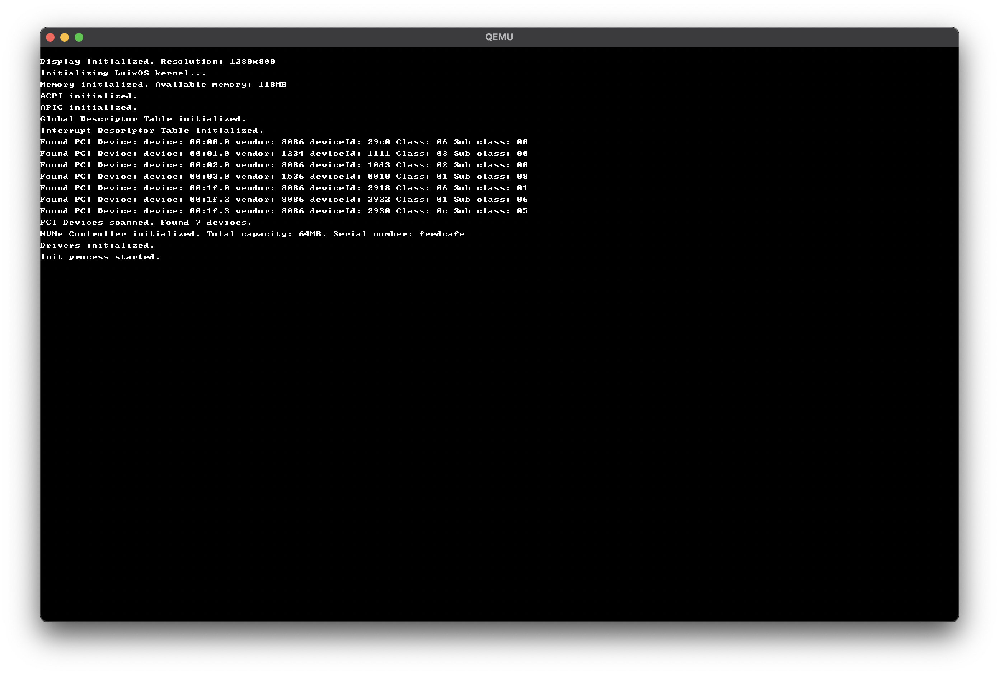

# Luix Operating System

Luix is a hobby operating system being developed in Rust. 

It is a 64-bit operating system that supports both x86-64 and AArch64 architectures, and it is heavily inspired by POSIX systems.

## Features

- 64 Bits
- amd64 and aarch64 support
- Multicore
- ACPI

## Development

### Bootloader
- [x] Bootloader(powered by Limine)

### Kernel
- [x] Graphic text mode
- [x] Interrupt Descriptor Table
- [x] Basic interrupt handling
- [x] Advanced Configuration and Power Interface(ACPI)
    - [x] Root System Description Table(RSDT)
    - [x] System Description Table(SDT)
    - [x] Multiple APIC Description Table(Madt)
- [ ] Advanced Programmable Interrupt Controller(APIC)
    - [x] Local APIC(Single Processor)
    - [ ] Local APIC(Multiple Processors)
    - [x] IO APIC
- [x] Interrupt handling with stack information
- [ ] Memory management
  - [x] Linked List Allocator
  - [ ] Paging
    - [x] Address Translation
    - [x] Page mapping
    - [x] Page unmapping
    - [ ] Address space switching
  - [x] Physical Memory Manager
    - [x] Memory Allocation
    - [x] Memory Deallocation
  - [x] Virtual Memory Manager
- [ ] Drivers
  - [x] Keyboard
  - [x] Timer
  - [x] PCI
  - [x] Storage
    - [x] NVMe 
- [ ] Global Descriptor Table
- [ ] System Calls
- [ ] Task Scheduler
- [ ] File System
  - [x] FAT32 Read Support
  - [ ] Ext2
  - [ ] VFS
- [ ] User Mode
- [ ] Multicore
    - [ ] Booting on multiple cores
    - [ ] Inter-Processor Interrupts(IPI)

## Screenshots

